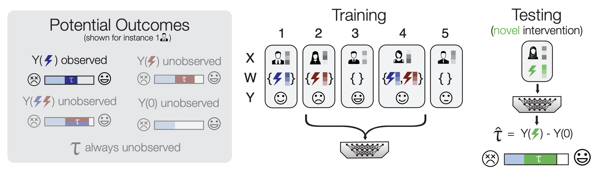

# Zero-shot causal learning

# Overview 

CaML (CAusal Meta-Learning) is a framework to predict the personalized effects of novel interventions on specific individuals. 

###  Overview of the zero-shot causal learning problem 

### Visual illustration of the CaML (causal meta-learning) framework 

# Citation 

MLA:

	Nilforoshan, H., Moor, M., Roohani, Y., Chen, Y., Šurina, A., Yasunaga, M., Oblak, S. and Leskovec, J., 2023. Zero-shot causal learning. NeurIPS 2023, the Thirty-seventh Annual Conference on Neural Information Processing Systems.

bibtex:

    @inproceedings{nilforoshan2023zero,
      title={Causal conceptions of fairness and their consequences},
      author={Nilforoshan, Hamed and Moor, Michael and Roohani, Yusuf and Chen, Yining and {\v{S}}urina, Anja and Yasunaga, Michihiro and Oblak, Sara and Leskovec, Jure},
      booktitle={Conference on Neural Information Processing Systems},
      year={2023},
      organization={Advances in Neural Information Processing Systems}
    }

    
# Abstract 

Predicting how different interventions will causally affect a specific individual is important in a variety of domains such as personalized medicine, public policy, and online marketing. There are a large number of methods to predict the effect of an existing intervention based on historical data from individuals who received it. However, in many settings it is important to predict the effects of novel interventions (e.g., a newly invented drug), which these methods do not address. Here, we consider zero-shot causal learning: predicting the personalized effects of a novel intervention. We propose CaML, a causal meta-learning framework which formulates the personalized prediction of each intervention's effect as a task. CaML trains a single meta-model across thousands of tasks, each constructed by sampling an intervention, along with its recipients and nonrecipients. By leveraging both intervention information (e.g., a drug's attributes) and individual features (e.g., a patient's history), CaML is able to predict the personalized effects of novel interventions that do not exist at the time of training. Experimental results on real world datasets in large-scale medical claims and cell-line perturbations demonstrate the effectiveness of our approach. Most strikingly, CaML's zero-shot predictions outperform even strong baselines trained directly on data from the test interventions.

******NOTE: THIS REPOSITORY IS EXTREMELY MESSY AND IN NEED OF FURTHER CLEANING*****. 

While it is functional, it is not pretty at this point. We hope to clean it up and encapsulate it soon. Also, the branch for LINCS setting in the LINCS_BRANCH folder. 

## Experiments 
All our experiment configurations can be found under `experiments/`

For instance, to run the hyperparameter search for the proposed model, CaML, we create a Weights & Biases sweep using the yaml file: 
`experiments/full_model.yaml` and then start the sweep agent.  
Alternatively, a single model fit can be started by executing the file `experiments/full_model.sh`, however the `.sh` files are just for illustrative purposes and the exact configuration may not be up-to-date, as the .yaml files were used for all experiments. 

Our experiment folder contains numeric results under `experiments/results`.  
Under `experiments/results/claims` all the evaluation metrics for all methods in the Claims dataset are logged.  
Under `experiments/results/lincs` all the evaluation metrics for all methods in the LINCS dataset are logged.  

## Training a model:  

To train a model on the Claims Dataset, we use the train_caml.py script, example below. Note, however that the Claims dataset is private and can not be released at this point. 

``$ python metalearn/train_caml.py --batch_norm=true --batch_size=8192 --dropout=0 --l1_reg=0.000001 --learning_rate=0.001 --loss=mse --meta_batch_size=4 --meta_learning_rate=2 --meta_learning_rate_final_ratio=0.1 --model_dim=256 --n_iterations=1000 --n_layers=6 --caml_k=50 --step=tau --task_embedding_config=early_concat --use_lr_scheduler=false --use_task_embeddings=true --val_interval=5 --weight_decay=0.005 ``  

Key parts of this are outlined below: 
- Lines (approx 69-76) starting with ``exclusionLoader = QueryPatientsByDrug()``: here we load the validation and testing drugs, and get the patient IDs of individuals who took these drugs, so we can hide them from the training (and hide testing drug patients from the validation) 
- Lines 98-104 starting with ``for val_task in val_tasks`` Here we load the validation tasks (drugs) and store them for zero-shot validation during training 
- Lines 132-135 starting with ``te_mapper = TaskEmbeddingMapper`` This class takes as input the task ID (DrugBank ID) and returns the task (drug) embedding. This is later fed into the model
- Lines 149-194 starting with ``if use_task_embeddings:``. There are currently three options 1) Don't use task embeddings 2) Concatenate the task embeddings at the very beginning of the neural network as ordinary features (models.MLPModel) 3) Concatenate the task embeddings later in the neural network after we have applied some encoding to the patient-level information (models.MLPLateConcatModel). Here depending on the hyperparameters we initialize one of these 3 models.
- Lines 280-323 starting with ``sampled = df_tasks.sample(n=1,weights=sample_weights).squeeze()``. Here we 1) sample a task from the list of all tasks (tasks are a sinle or combination of drugs 2) Process the task to calculate the \tau label (the estimate of the causal effect) and filter for only patients who received the drug (W=1). Here note that X is a sparse matrix
- Lines 325-342 starting with ``if use_task_embeddings:`` Here we create the associated dataset and dataloader for the task. Note that if we are using task embeddings the ClaimsTaskDataset class separates the sparse patient-level features (X_train_1) from the dense drug-level features (task_embedding) so that we have the option to concatenate them later on
- Lines 391-460 starting with ``if iteration%args.val_interval==0:`` Here we validate the zero-shot performance of our model on a set of unseen validation drugs. We loop through the drugs, generate predictions, and then measure performance using 2 main metrics (RATE, Recall)

(NOTE: the exact line numbers may be out of sync with latest code stage, but the explanations may still be useful) 
While our models are currently initialized inside the train_caml.py script depending on experimental configurations, `src/models/caml.py` contains a model class pointing to the building blocks of our method. (We intend to clean all methods to have separate model classes with model-specific parsers). 

## Environment

### Claims setting
`virtualenv caml_env` to start virtual_env named caml_env  

`source caml_env/bin/activate` to activate the env  

`source caml_env/install.sh` to install all the libraries (also cuda-version torch etc)

### LINCS setting
WIP (#TODO: add env setup)

